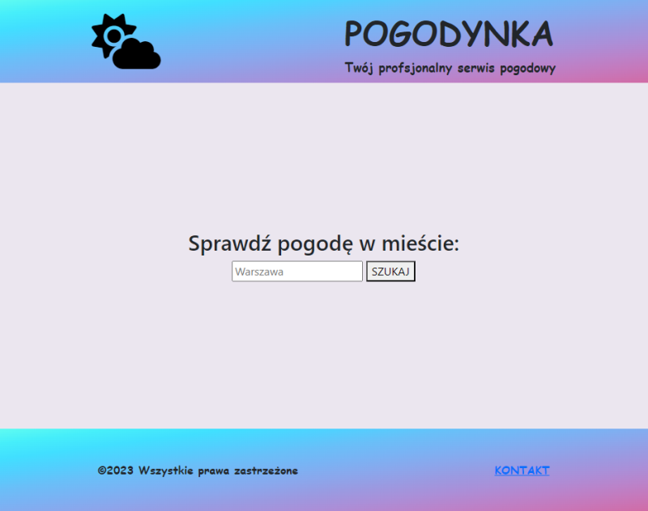

<a name="readme-top"></a>

[![Forks][forks-shield]][forks-url]
[![Stargazers][stars-shield]][stars-url]
[![Issues][issues-shield]][issues-url]

<!-- PROJECT LOGO -->
<br />
<div style="display: flex; align-items: center; justify-content: center">
  <a href="https://github.com/MalTok/Pogodynka">
    
  </a>

<h1>Pogodynka</h1>

  <p>
    A simple weather service
   <br />
    <a href="https://github.com/MalTok/Pogodynka"><strong>Explore the docs »</strong></a>
    <br />
    <br />
    <a href="https://youtu.be/_tduqGs1Pjc">Live Demo</a>
    ·
    <a href="https://github.com/MalTok/Pogodynka/issues">Report Bug</a>
    ·
    <a href="https://github.com/MalTok/Pogodynka/issues">Request Feature</a>
  </p>
</div>

<!-- TABLE OF CONTENTS -->
<details>
  <summary>Table of Contents</summary>
  <ol>
    <li>
      <a href="#about-the-project">About The Project</a>
      <ul>
        <li><a href="#built-with">Built With</a></li>
      </ul>
    </li>
    <li>
      <a href="#getting-started">Getting Started</a>
      <ul>
        <li><a href="#cloning">Cloning</a></li>
      </ul>
    </li>
    <li><a href="#usage">Usage</a></li>
    <li><a href="#contributing">Contributing</a></li>
    <li><a href="#contact">Contact</a></li>
  </ol>
</details>

<!-- ABOUT THE PROJECT -->

## About The Project

[![Product Name Screen Shot][product-screenshot]](https://github.com/MalTok/Pogodynka)

This project is in fact a simple feature that fetches weather data from public API of https://openweathermap.org/api and
displays this data in more visual friendly form.
Should be used along with an additional API for location search: https://openweathermap.org/api/geocoding-api

<div style="display: flex; background-color: black; justify-content: center; width: 200px">
<a href="https://openweathermap.org">
   
</a>
</div>

<p style="text-align: right">(<a href="#readme-top">back to top</a>)</p>

### Built With

- [![Java][Java.com]][Java-url]
- [![Maven][Maven.apache.org]][Maven-url]
- [![Spring Boot][Spring.io]][Spring-url]
- [![Thymeleaf][Thymeleaf.org]][Thymeleaf-url]
- [![Bootstrap][Bootstrap.com]][Bootstrap-url]
- Lombok

<p style="text-align: right">(<a href="#readme-top">back to top</a>)</p>

<!-- GETTING STARTED -->

## Getting Started

To get a local copy follow these simple steps below.

IMPORTANT NOTE: Please get our own API KEY first - openweathermap.org is not free of charge, although currently there is
a small limit of free requests per day for every account.

### Cloning

1. Get a free API Key after quick registration at [https://openweathermap.org/](https://openweathermap.org/)
2. Clone the repo
   ```sh
   git clone https://github.com/MalTok/Pogodynka.git
   ```
3. Enter your API in `WeatherService.java` file
   ```sh
   private static final String API_KEY = "enter_your_ke_here";
   ```
   You can also change `UNITS` and `LANG`.
   Read more [_here_](https://openweathermap.org/api/one-call-3#data) and [
   _here_](https://openweathermap.org/api/one-call-3#multi)

4. Launch app in your browser at: `localhost:8080` and enjoy!

<p style="text-align: right">(<a href="#readme-top">back to top</a>)</p>

<!-- USAGE EXAMPLES -->

## Usage

Possibly you can implement this feature in your application like news service, local website, blog.

<p style="text-align: right">(<a href="#readme-top">back to top</a>)</p>

<!-- CONTRIBUTING -->

## Contributing

Contributions are what make the open source community such an amazing place to learn, inspire, and create. Any
contributions you make are **greatly appreciated**.

If you have a suggestion that would make this better, please fork the repo and create a pull request. You can also
simply open an issue with the tag "enhancement".
Don't forget to give the project a star! Thanks again!

1. Fork the Project
2. Create your Feature Branch (`git checkout -b feature/AmazingFeature`)
3. Commit your Changes (`git commit -m 'Add some AmazingFeature'`)
4. Push to the Branch (`git push origin feature/AmazingFeature`)
5. Open a Pull Request

<p style="text-align: right">(<a href="#readme-top">back to top</a>)</p>

<!-- CONTACT -->

## Contact

mig01@wp.pl

Project Link: [https://github.com/MalTok/Pogodynka](https://github.com/MalTok/Pogodynka)

<p style="text-align: right">(<a href="#readme-top">back to top</a>)</p>

[forks-shield]: https://img.shields.io/github/forks/MalTok/Pogodynka.svg?style=for-the-badge

[forks-url]: https://github.com/MalTok/Pogodynka/forks

[stars-shield]: https://img.shields.io/github/stars/MalTok/Pogodynka.svg?style=for-the-badge

[stars-url]: https://github.com/MalTok/Pogodynka/stargazers

[issues-shield]: https://img.shields.io/github/issues/MalTok/Pogodynka.svg?style=for-the-badge

[issues-url]: https://github.com/MalTok/Pogodynka/issues

[product-screenshot]: images/pogodynka.png

[Java.com]: https://img.shields.io/badge/Java-%23F80000?style=for-the-badge&logo=oracle

[Java-url]: https://www.java.com

[Maven.apache.org]: https://img.shields.io/badge/Maven-%23C71A36?style=for-the-badge&logo=apachemaven&logoColor=black

[Maven-url]: https://maven.apache.org

[Thymeleaf.org]: https://img.shields.io/badge/Thymeleaf-%23005F0F?style=for-the-badge&logo=thymeleafhttps://img.shields.io/badge/Thymeleaf-%23005F0F?style=for-the-badge&logo=thymeleaf

[Thymeleaf-url]: https://www.thymeleaf.org

[Bootstrap.com]: https://img.shields.io/badge/Bootstrap-563D7C?style=for-the-badge&logo=bootstrap&logoColor=white

[Bootstrap-url]: https://getbootstrap.com

[Spring.io]: https://img.shields.io/badge/Spring%20Boot-%236DB33F?style=for-the-badge&logo=springboot&logoColor=black

[Spring-url]: https://spring.io/projects/spring-boot
